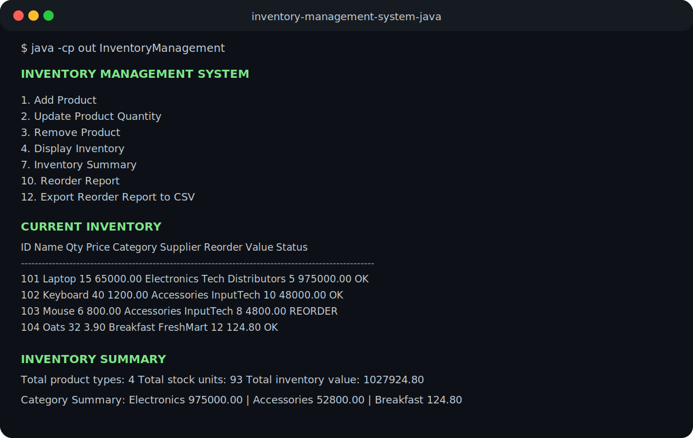

# Inventory Management System in Java


A Java-based command-line inventory management system that allows users to manage product records using object-oriented programming, file handling, data validation, persistent text-file storage, inventory analytics, sorting, reorder tracking, supplier tracking, and CSV export.

This project is designed as a beginner-to-intermediate Java portfolio project that demonstrates CRUD operations, search, validation, low-stock detection, layered code structure, safe inventory file updates, report generation, and basic inventory valuation.

---

## Sample Output



---

## Project Overview

The Inventory Management System helps users maintain a simple product inventory from the terminal. Users can add new products, update stock quantities, remove products, search existing items, display all inventory records, identify products below a custom low-stock threshold, sort inventory, view inventory analytics, track suppliers, track reorder levels, and export records to CSV.

The application stores product data in a local `inventory.txt` file, allowing inventory records to persist after the program exits.

---

## Key Features

- Add new products with product ID, name, quantity, price, category, supplier, and reorder level
- Prevent duplicate product IDs
- Update product quantities
- Remove products from inventory
- Display all inventory records in a table format
- Search products by ID
- Search products by name or keyword
- Show low-stock products using a custom threshold
- Show products that need reordering based on each product's reorder level
- Sort inventory by ID, name, quantity, price, category, or total value
- Calculate total product types
- Calculate total stock units
- Calculate total inventory value
- Show category-wise inventory value summary
- Export full inventory data to CSV
- Export reorder report to CSV
- Validate integer and decimal inputs
- Prevent empty product names, categories, and supplier names
- Prevent invalid negative quantities, prices, and reorder levels
- Store inventory data using file handling
- Save data safely using a temporary file before replacing the main inventory file
- Uses separate classes for UI, product model, business logic, and file storage
- Includes GitHub Actions build verification
- Licensed under the MIT License

---

## Technologies Used

- Java
- Object-Oriented Programming
- File handling
- Collections / ArrayList
- HashMap and category grouping
- Comparators and sorting
- Command-line interface
- Input validation
- Persistent storage using text files
- CSV export
- Layered application structure
- GitHub Actions CI

---

## Project Structure

```text
.
├── .github/
│   └── workflows/
│       └── java-build.yml
├── src/
│   ├── InventoryManagement.java
│   ├── InventoryService.java
│   ├── FileStorage.java
│   └── Product.java
├── screenshots/
│   └── sample-output.svg
├── inventory.txt
├── README.md
├── LICENSE
├── UPGRADE_PLAN.md
└── .gitignore
```

---

## Class Responsibilities

| Class | Responsibility |
|---|---|
| `InventoryManagement` | Handles menu display, user input, command-line interface flow, and result printing |
| `InventoryService` | Handles inventory business logic, sorting, analytics, search, low-stock filtering, reorder detection, category summary, and CSV export |
| `FileStorage` | Handles reading products from `inventory.txt` and saving products safely |
| `Product` | Represents one inventory item with ID, name, quantity, price, category, supplier, reorder level, stock status, and total value |

---

## How to Compile

From the project root directory, run:

```bash
javac -d out src/*.java
```

---

## How to Run

```bash
java -cp out InventoryManagement
```

---

## Menu Options

```text
===== INVENTORY MANAGEMENT SYSTEM =====
1. Add Product
2. Update Product Quantity
3. Remove Product
4. Display Inventory
5. Low Stock Alert
6. Search Product
7. Inventory Summary
8. Sort Inventory
9. Export Inventory to CSV
10. Reorder Report
11. Category Summary
12. Export Reorder Report to CSV
13. Exit
```

---

## Data Storage Format

Inventory data is stored in `inventory.txt` using comma-separated values.

Example:

```text
101,Laptop,15,65000.00,Electronics,Tech Supplier,5
102,Keyboard,40,1200.00,Accessories,Office Supplier,10
103,Mouse,25,800.00,Accessories,Office Supplier,8
```

Each line contains:

```text
Product ID, Product Name, Quantity, Unit Price, Category, Supplier, Reorder Level
```

The parser also supports older 3-column and 5-column formats for backwards compatibility.

---

## Sample Demo Flow

### Add Product

```text
Product ID: 101
Product Name: Laptop
Quantity: 15
Unit Price: 65000
Category: Electronics
Supplier: Tech Supplier
Reorder Level: 5
Product added successfully.
```

### Display Inventory

```text
ID       Name                 Qty      Price      Category        Supplier             Reorder  Value        Status
------------------------------------------------------------------------------------------------------------------------
101      Laptop               15       65000.00   Electronics     Tech Supplier        5        975000.00    OK
102      Keyboard             40       1200.00    Accessories     Office Supplier      10       48000.00     OK
103      Mouse                6        800.00     Accessories     Office Supplier      8        4800.00      REORDER
```

### Inventory Summary

```text
Total product types: 3
Total stock units: 61
Total inventory value: 1027800.00
```

### Category Summary

```text
Electronics: 975000.00
Accessories: 52800.00
```

### CSV Export

```text
Enter CSV file name, e.g. inventory_export.csv: inventory_export.csv
Inventory exported successfully to inventory_export.csv
```

---

## Concepts Demonstrated

| Concept | How It Is Used |
|---|---|
| Object-Oriented Programming | Product, service, storage, and UI responsibilities are separated |
| File Handling | Inventory records are read from and written to `inventory.txt` |
| CRUD Operations | Add, update, remove, and display products |
| Input Validation | Invalid IDs, quantities, prices, reorder levels, and empty fields are handled |
| Search | Products can be searched by ID or name |
| Sorting | Products can be sorted by ID, name, quantity, price, category, or value |
| Data Persistence | Inventory data remains saved after program exit |
| Inventory Analytics | Total stock units, total inventory value, and category-wise values are calculated |
| Reorder Logic | Products are flagged when quantity is less than or equal to reorder level |
| Supplier Tracking | Supplier names are stored and displayed for each product |
| CSV Export | Product records and reorder reports can be exported into CSV files |
| Safe File Update | Temporary file is used before replacing the inventory file |
| CI/build verification | GitHub Actions workflow |
| Layered Design | UI, business logic, storage, and model code are separated |

---

## Continuous Integration

This repository includes a GitHub Actions workflow that automatically compiles the Java source files on every push and pull request.

```text
.github/workflows/java-build.yml
```

---

## License

This project is licensed under the MIT License. See the `LICENSE` file for details.

---

## Why This Project Is Useful

This project demonstrates how a real-world inventory problem can be solved using core Java concepts. It shows the ability to build a complete terminal-based application with structured data, validation, persistent storage, modular class design, analytics, reorder tracking, supplier tracking, CSV export, and user-friendly menu navigation.

---

## Future Enhancements

- Add SQLite or MySQL database support.
- Add Java Swing or JavaFX graphical user interface.
- Add Spring Boot backend version.
- Add React frontend for a full-stack version.
- Add login system with admin and staff roles.
- Add sales and purchase history.
- Add CSV import.
- Add automated unit tests.
- Add dashboard analytics such as supplier-wise stock value and reorder count.

---

## Resume Summary

Built a Java-based inventory management system implementing CRUD operations, product search, low-stock detection, reorder-level tracking, supplier tracking, input validation, object-oriented class separation, price/category tracking, inventory valuation, sorting, category-wise analytics, CSV export, reorder report export, GitHub Actions build checks, and persistent file-based storage through a command-line interface.
